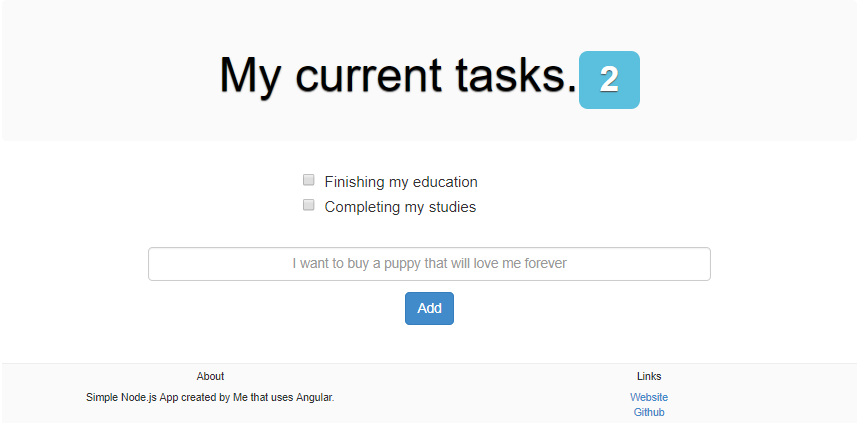

# Todo-List
A simple todo list that stores tasks in a remote mongodb database and uses angular and node.js

In order to run use

```
git clone https://github.com/FriendlyUser/Todo-List.git
npm install
node server.js
```

A sample screenshot of this application is below:


Can be viewed live at